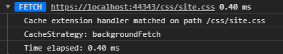

# Scaffold

## Logging

Logging is a critical component to determining what is happening in code once it grows up and makes its way to the next environment. Logging in service workers and in Scaffold is no different. For that reason logging works out of the box and is always available to you.

## Access the `ILogger` instance

Three are three ways to access the `ILogger` instance utilizing during the service worker building process and fetch pipeline execution.

### `IApplicationBuilder`

When building the fetch request pipeline, you can access the `ILogger` instance by utilizing `services` found on `IApplicationBuilder`.

```ts
const logger = builder.services.getInstance<ILogger>("ILogger");
logger.debug("This is a debug message!");
```

Alternatively, the `ILogger` instance is also passed in ase the second parameter to the `configure` method of your `IStartup` class.

```ts
public configure(applicationBuilder: IApplicationBuilder, logger?: ILogger): void {
    logger.debug("This is a debug message!");
}
```

### `FetchContext`

When executing the fetch request pipeline, you can call the `log` method found on `FetchContext`.

```ts
context.log(LogLevel.Debug, "This is a debug message!");
```

In an effort to keep the logs pertaining to a specific fetch request organized, the log entries created through the `log` method are grouped together and shown at the end of the fetch request.



### `ConfigureServices`

When configuring your services in the `configureServices` method of your `IStartup` class, the `ILogger` instance is available as the second parameter.

```ts
public configureServices(services: IServiceCollection, logger?: ILogger): void {
    logger.debug("This is a debug message!");
}
```

## Logging level

Defining the appropriate severity of a log message is almost as important as logging the message itself. As a result, there are 4 level available to accurately describe the importance of the message.

- `Debug` - Intended for debugging purposes
- `Info` - Intended to provide high level information without finer details
- `Warn` - Describe potential issues that aren't necessarily breaking functionality
- `Error` - Something has gone wrong.

There are methods for each of these levels in addition to flags to check if a level is currently supported (e.g. `isDebug`, `isWarn`);

If you want to change the log level at any time during execution of your service worker, just set the `logLevel` value on the `ILogger` instance.

```ts
logger.logLevel = LogLevel.Info;
```

The default service worker builder instantiates an `ILogger` instance with a log level based upon the `environment` value of the `IServiceWorkerConfiguration` object. When in `"development"` the log level is set to `Debug`. Alternatively when in `"production"` the log level is set to `Info`.

## Custom `ILogger` implementations

### `LogLevel`

To change the log level at startup of the worker, utilize the `configureLogging` method available on `IServiceWorkerBuilder`.

```ts
Scaffold
    .createDefaultBuilder("1.0.0")
    .configureLogging(loggingBuilder => {
        // Set the desired log level
        loggingBuilder.logLevel = LogLevel.Info;
    })
    ...
```

### Custom type

You also can replace the default logger by providing your own custom logger implementation. To do this, utilize the `configureLogging` method available on `IServiceWorkerBuilder`.

```ts
Scaffold
    .createDefaultBuilder("1.0.0")
    .configureLogging(loggingBuilder => {
        // Define the logger factory
        loggingBuilder.loggerFactory = () => new CustomLogger();
    })
    ...
```

## See Also

* [FetchContext](../fetch-context.md)
* [ILogger](ilogger.md)
